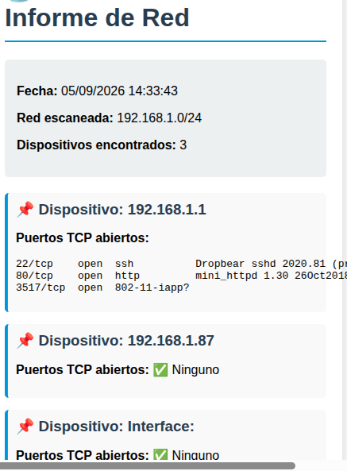

## 📡 HXG Scan Pro


**HXG Scan Pro** es un escáner de red escrito en Bash que:

- Detecta automáticamente la red local (`192.168.x.0/24`).
- Escanea dispositivos activos con `nmap` y `arp-scan`.
- Identifica puertos abiertos y servicios en ejecución.
- Genera un informe en **HTML** con diseño profesional.
- Abre el informe directamente en el navegador.

### 🔧 Requisitos
- Linux (probado en Ubuntu 22.04)
- `nmap`
- `arp-scan`
- Navegador web (Firefox, Chrome, Brave, Edge)

### ▶️ Ejecución
```bash
chmod +x hxg_scan_pro.sh
./hxg_scan_pro.sh

### 📄 Ejemplo de informe




---

## 📬 Contacto
Si tienes problemas al ejecutar el script, escríbeme a **walter_aguirre2010@hotmail.com**  
Te lo explico paso a paso y con ejemplos simples.

